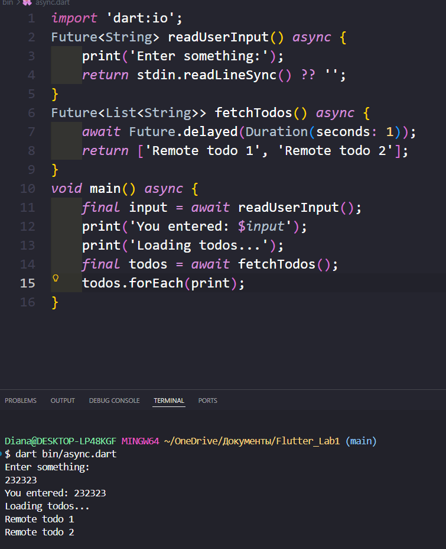

# Лабораторная работа №1. Быстрое погружение в язык Dart
## Кузьмина Диана Александровна
## ИСП-232
## Цель работы: Изучить основы языка Dart, сравнивая синтаксис и концепции с ранее изученными языками Kotlin и C#. Создать консольное приложение ToDo.
___

___
ну крч клонировать ссылку на проект, перейти в нее. установить флаттен и запустить 👍